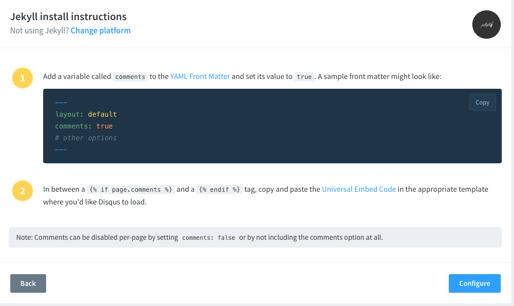
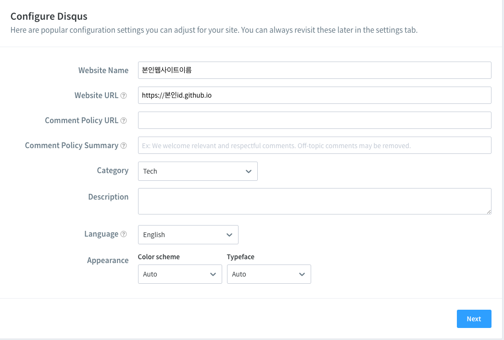
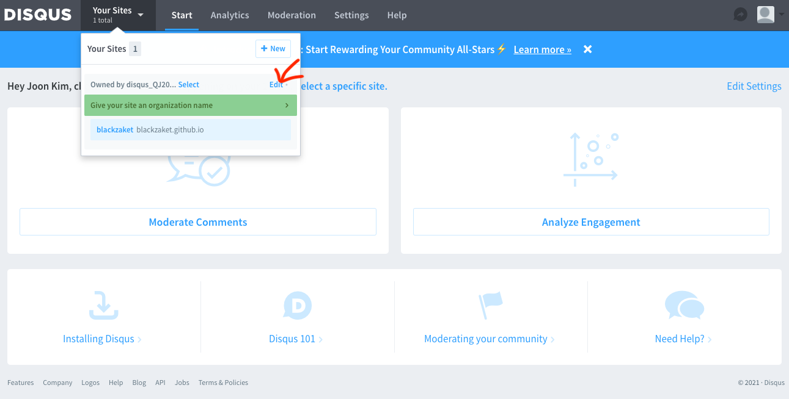
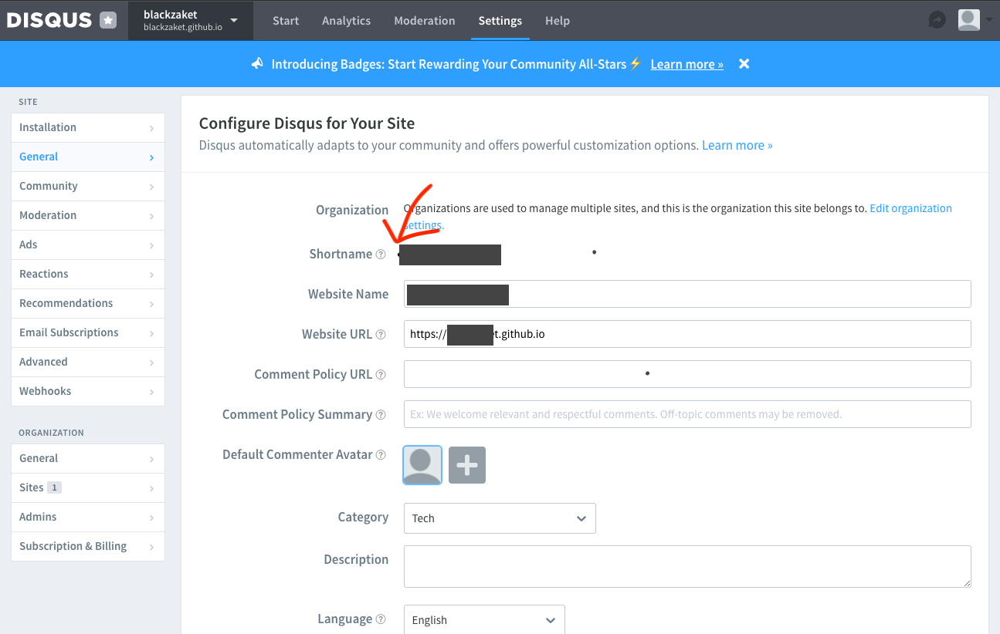

<br>
<br>
<br>  

## 댓글 플러그인을 설치 하는 과정은 다음과 같습니다.  

<br>

1. 여러 댓글 플러그인이 존재 한다. 
2. Disqus를 달아 보자 
3. 해당 layout.html 파일을 편집하자. 
4. 확인 하자. 

<br>
<br>
<br>  


## 1. 여러 댓글 플러그인이 존재 한다. 
jekyll blog를 이용하면 기본적으로 제공하는 댓글 시스템이 없다. 
이는 기본적으로 github에서 web server만을 제공하기 때문인데 이를 해결하기 위해서 여러 댓글 서비스를 이용할 수 있다. 그중에서도 Diqus와 Facebook 댓글 plugin 이 있는데 여기에서는 Disqus를 소개 하겠다.  
여러 다른 github를 이용한 블로그를 보다 보면 확인 할 수 있을 것이다. 맘에 드는 댓글 서비스가 있다면 해당내용을 검색해서 github blog에 적용 할 수 있다.  

<br>
내가 Disqus를 선택한 이유는 

### - 첫째. 많은 사람들이 이용하고 있어서 문제점과 마주하게 되었을때에도 검색을 통해 쉽게 도움을 받을 수 있을 거라는 판단 하나와 

### - 둘째. 내가 다운받은 테마의 파일 중간에 Disqus의 흔적이 남아 있어서 였다. 그만큼 보편적인 서비스라는 생각에서 선택 하게 되었다. 

<br>
다 설치하고 나서 facebook 댓글 plugin을 마주하게 되었는데 이때 잠깐 고민했다. pc에서 facebook을 사용하고 있는 사용자의 경우는 사람들이 댓글을 위해서 댓글 서비스에 login 하는 수고를 덜어 줄 수 있다고 생각했기 때문이다. 하지만 우선은 Disqus를 써보기로 했다. 나중에 정 불편 하면 facebook으로 이동하는것으로.. 


<br>
<br>

## 2. Disqus를 달아 보자 
우선 간단한 정보 입력으로 disqus.com 사이트에 가입하자. 
가입하고 나면 선택 메뉴가 보일텐데 **install**을 선택하고 아래와 같은 화면에서 jekyll을 선택하자 


<br>
<br>
<br>
간단한 설정 화면이 나오고 




<br>
post할파일에서 어떻게 사용할지 간략한 설명이 있다. 

```md
comments : true 
```
<br>  

라고 하는 부분과  그아래 설명중  

~~~

  
  /*Disqus에서 제공하는 코드가 들어가는 부분*/


~~~


라고 하는 부분이 중요 한데. 

처음 comments: true라고 하는 부분은 posting 하는 md 파일 안에 문서 시작에 설정하는 부분이다.  
이값을 기준으로 댓글 부분을 표시 할지 하지 않을지를 결정한다. 

아래 if문의 경우는 _layouts/post.html 에서 댓글을 표시할 부분에 넣는 부분이다. 포스팅하는 md파일에서 설정값으로 넣었던 comments: true 값이 이 if문에서 씌인다. 

<br>
<br>
<br>


Configure 버튼을 클릭하면 웹사이트 설정을 할 수 있는 화면이 나온다.  




<br>
<br>
<br>

블로그 정보를 넣고 설정을 끝내면 Admin메뉴에서 site 정보를 확인 할 수 있다.  




<br>
<br>
<br>

여기서 Shortname을 기억해 두자!  




<br>
<br>
<br>

## 3. 해당 layout.html 파일을 편집하자. 

install 과정중 "Universal Embed Code"를 따라가서 얻게 되는 코드인 다음 코드를  

```html
<div id="disqus_thread"></div>
  <script>
      /**
      *  RECOMMENDED CONFIGURATION VARIABLES: EDIT AND UNCOMMENT THE SECTION BELOW TO INSERT DYNAMIC VALUES FROM YOUR PLATFORM OR CMS.
      *  LEARN WHY DEFINING THESE VARIABLES IS IMPORTANT: https://disqus.com/admin/universalcode/#configuration-variables    */
      /*
      var disqus_config = function () {
      this.page.url = PAGE_URL;  // Replace PAGE_URL with your page's canonical URL variable
      this.page.identifier = PAGE_IDENTIFIER; // Replace PAGE_IDENTIFIER with your page's unique identifier variable
      };
      */

      (function() { // DON'T EDIT BELOW THIS LINE
      var d = document, s = d.createElement('script');
      s.src = 'https://본인사이트id.disqus.com/embed.js';
      s.setAttribute('data-timestamp', +new Date());
      (d.head || d.body).appendChild(s);
      })();
  </script>
  <noscript>Please enable JavaScript to view the <a href="https://disqus.com/?ref_noscript">comments powered by Disqus.</a></noscript>    
        
```

를 댓글이 필요한 layout파일에 if문을 이용해서 정의 하면 해당 comments 값에 따라 댓글을 표시 하거나 표시 하지 않는다.  


<br>
<br>
<br>

## 4. 확인 하자. 

모든 과정이 끝났으면 내용이 적용된 파일을 github repository에 push하고 댓글을 달 수 있는 Disqus 댓글창이 나오는지 확인 하자.  

<br>

# 끝~!!! 


<br>
<br>
<br>
<br>
<br>
